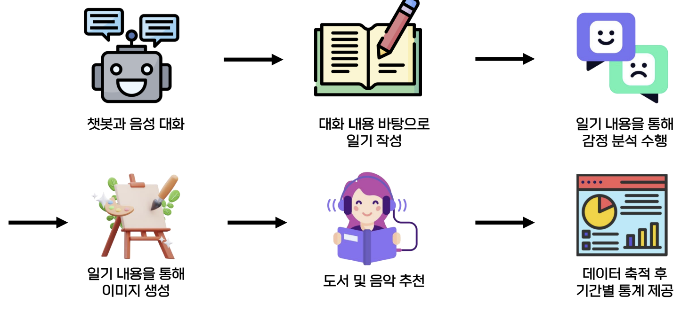
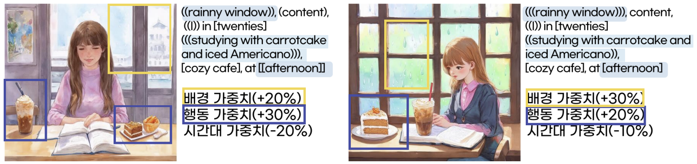
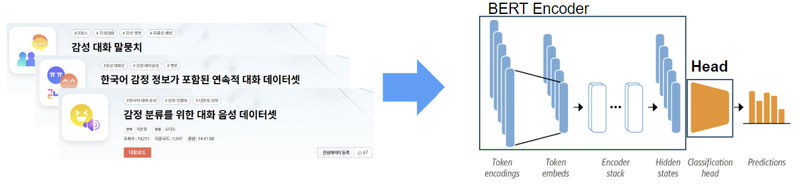
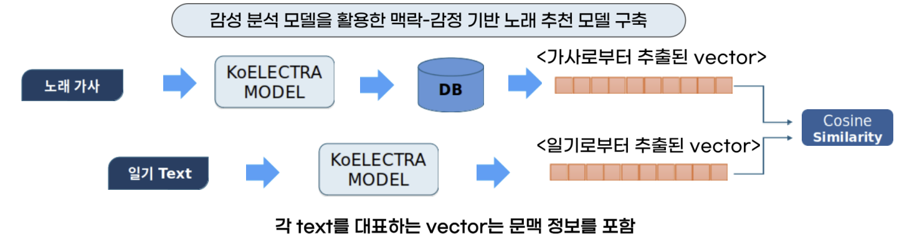
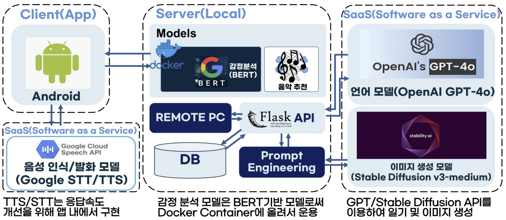

# 포스코 AI-Bigdata Academy 26기 Poday_Diary

- 일기쓰기... 귀찮으시죠? GPT와 대화를 통해서 손쉽게 일기를 작성하고, 그에 맞는 그림까지 그려드려요.

### 조원(26기 A2조)

- 정승활(조장), 김수성, 이호정, 최지영, 홍연수

### 구현 기능

##### 프로세스

- `기간별 통계 내용`과 `도서 추천 기능`은 최종 버전에 포함되지 않습니다.

**1. 일기생성**

- `openai GPT-4o` 모델을 활용한 일기 생성
- `Assitants Prompts`를 활용해 모델에 역할/페르소나 주입
- [OpenAI Official Documents](https://platform.openai.com/docs/quickstart)

**2. 일기에 맞는 그림 생성**

- `Stable Diffusion Model`을 활용한 이미지생성
- 각각의 키워드들은 영어로 입력
- [StabilityAI/StableDiffusion Official Documents](https://stable-diffusion-art.com/beginners-guide/)

**3. 일기 감정분석**

- 데이터셋 출처: [AI_HUB](https://www.aihub.or.kr/)
- `HuggingFace Hub`의 모델을 훈련하여 FineTuning 수행
- 기반 모델 링크: [monologg/KoElectra](https://github.com/monologg/KoELECTRA)
- 최종구축 모델: [blue2959/koelectra-base-v3-discriminator-finetuned-kor-8-emotions_v1.4](https://huggingface.co/blue2959/koelectra-base-v3-discriminator-finetuned-kor-8-emotions_v1.4)
- [모델설명은 여기를 참고하세요!](https://huggingface.co/blue2959/xlm-roberta-base-finetuned-kor-8-emotions_v1.2)

**4. 노래 추천**

- 노래 정보 크롤링 -> BERT에 input으로 가사 삽입 -> Vector 추출 -> Binary 파일로 저장(pickle)
- `BERT` 기반 감정가사 분석을 이용한 노래 추천 시스템 구축

### 구현방법

- 음성인식 기능으로 `Google TTS/STT API` 이용
- `BERT` 기반 감정분석
- `GPT-4o/Stable Diffusion` 을 활용한 생성모델 일기/그림 생성
- `Server` 폴더에 Flask를 이용한 웹서버 호스팅 / 앱으로 구현

### 시연연상

[Poday_Diary](https://youtu.be/HP6xcFsMpQY)

### References(추가예정)

##### Contact

- 김수성, `blue2959@naver.com`
  
- :smile: 아카데미 여러분들 힘내세요! :smile: